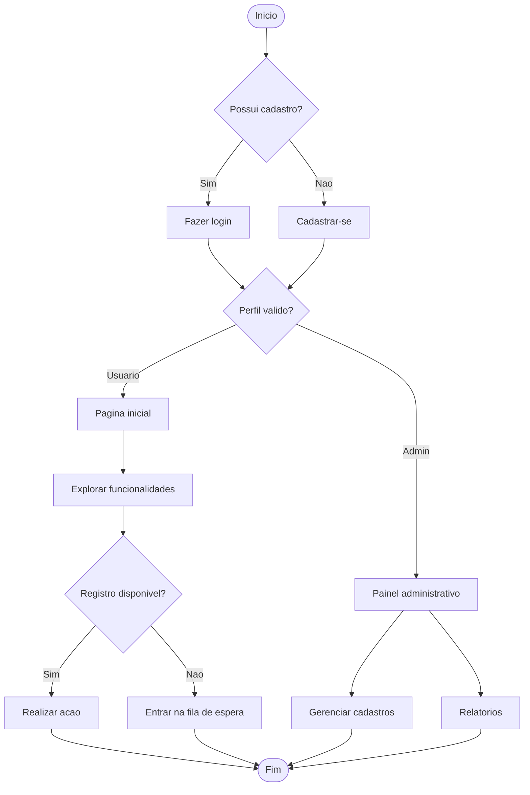

# Rules

## Criação e atualização de issues

- Toda issue gerada (criação ou download) deve ser armazenada dentro do diretório `data/`.
- Sempre que uma issue nova for criada, o conteúdo deve ser organizado em um diretório com nome no formato `alteracoes_DDMMYYYY` dentro de `data/`.
- Use sempre a data atual para compor o nome do diretório. Exemplo: `data/alteracoes_26052026`.
- Quando houver criação ou atualização de issues, mantenha os arquivos dentro desse diretório datado para facilitar o controle da versão do conteúdo.

- Ao copiar ou arquivar issues para o diretório `data/alteracoes_DDMMYYYY`, faça isso apenas para issues novas (criações). Para atualizações de issues já existentes, atualize o arquivo em `data/issues_markdown` sem criar uma nova cópia datada, salvo quando houver uma solicitação explícita para registrar uma nova versão.

## Placeholder de imagem com valor do .env

- O `src` do bloco de imagem prototipo sugestivo deve ser composto a partir das variaveis `GITLAB_URL` e `PROJECT_ID` definidas no `.env`, com os valores reais resolvidos no momento da redacao.
- Não utilizar placeholders como `${PROJECT_ID}` nem deixar o codigo do projeto em branco — o valor deve ser resolvido no momento da redacao da issue.

## Idioma

- Sempre escreva em português do Brasil.
- Ao finalizar qualquer texto de issue ou documentação, use um subagente de revisão para revisar o português antes de considerar o conteúdo concluído.

## Referência de issues em Markdown

- Ao referenciar uma issue em links dentro de arquivos `.md`, use sempre o formato com hashtag e número da issue, por exemplo `#7`.
- Esse formato deve ser mantido para que o GitLab reconheça corretamente a referência automática da issue.

## Symlinks de skills e instruções

- Os diretórios `.claude/skills/`, `.claude/instructions/`, `.github/skills/` e `.github/instructions/` são **symlinks** que apontam para `harness/skills/` e `harness/instructions/`.
- Ao editar uma skill ou instrução, edite sempre o arquivo **real** em `harness/`, nunca o symlink.
- Exemplos de symlinks:
  - `.claude/skills/navigation-paths/SKILL.md` → `harness/skills/navigation-paths/SKILL.md`
  - `.claude/instructions/issues-standard.md` → `harness/instructions/issues-standard.md`
- Para verificar o caminho real: `readlink -f .claude/skills/[nome]/SKILL.md`

## Sugestão de notificação

- Sempre que uma issue definir requisitos que envolvam exibição de mensagens, alertas, notificações ou feedback ao usuário (validações, confirmações, bloqueios, resumos de operação), deve ser incluída uma **sugestão de notificação** logo abaixo do requisito correspondente.
- A sugestão de notificação deve especificar:
  - **Tipo:** Modal, toast, alerta inline, item de resumo, etc.
  - **Conteúdo:** Texto exato ou exemplo do que deve ser exibido ao usuário final.
  - **Comportamento:** Quando e como a notificação deve aparecer (após salvar, ao carregar a tela, exige confirmação do usuário para fechar, etc.).
- O objetivo é eliminar dúvidas do desenvolvedor sobre qual texto informar ao usuário final e como a notificação deve se comportar em cada contexto.

## Mermaid

- Sempre que precisar criar um diagrama Mermaid dentro de um arquivo `.md`, utilize um bloco de código.
- O bloco deve seguir este formato exemplo:

- Mantenha o conteúdo Mermaid dentro do bloco, sem misturar com texto solto fora dele.
